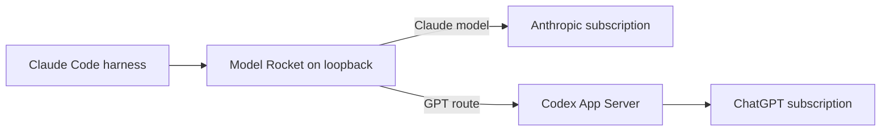

# Model Rocket

Use Claude Code as the harness, then choose Anthropic or GPT for each turn.

Model Rocket is a small local proxy.
It lets one unmodified Claude Code session use Claude or GPT-5.6 Sol.
Claude Code keeps its tools, hooks, skills, MCP servers, and permissions.
It also keeps its transcript, subagents, and worktrees.
Only the model request is routed.

```text
claude-gpt

> /model anthropic-model-rocket-gpt-5.6-sol-fast-high
> Use the Read tool to inspect this project.

> /model claude-fable-5
> Continue with Fable.
```

There is no patched Claude binary, TLS interception, or local CA.
There is no API-key billing.
Anthropic requests use Claude Code's existing subscription session.
GPT requests use the official Codex App Server and ChatGPT session.

## Why Model Rocket?

- One Claude Code session, two model providers.
- Keep Claude Code's complete harness instead of moving to another agent UI.
- Pick standard or fast GPT delivery with low or high reasoning.
- Delegate work to GPT subagents in Claude Code worktrees.
- Run locally on a random loopback port with a fresh launch-scoped bearer.
- Fail closed on unexpected binaries, models, credentials, or wire data.

## Quick start

Model Rocket verifies these runtime dependencies:

| Component             | Required version         |
| --------------------- | ------------------------ |
| Claude Code           | Official native release  |
| Codex CLI             | `0.153.4` native release |
| Shipped GPT catalogue | `gpt-5.6-sol`            |
| Rust                  | `1.94.1`                 |

Supported targets are macOS and glibc-based Linux on ARM64 or x86-64.
Windows and musl-based Linux are not supported in this edition.

The Anthropic subscription session must expose Model Rocket's default Claude model, currently `claude-fable-5`.
The ChatGPT subscription session must expose every model listed in `models`, currently `gpt-5.6-sol`.

### 1. Install and sign in to the vendor CLIs

Install the current stable official native [Claude Code][claude-setup] release.
Sign in with your Anthropic subscription:

```bash
claude install stable
```

Claude Code can update normally after installation.
At each launch, Model Rocket resolves the installed version and verifies its native artifact against Anthropic's official version-specific release manifest.

Install the pinned Codex package.
Copy its native executable to a stable path, then sign in with ChatGPT:

```bash
npm install --global @openai/codex@0.153.4

codex_native="$(find "$(npm root -g)/@openai/codex/node_modules/@openai" \
  -type f -path '*/vendor/*/bin/codex' -print -quit)"
test -n "$codex_native"

install -d -m 700 "$HOME/.local/bin"
install -m 755 "$codex_native" "$HOME/.local/bin/codex-native"
"$HOME/.local/bin/codex-native" login
```

The npm package is used only to obtain OpenAI's native executable.
The JavaScript wrapper is not used at runtime.

### 2. Build and install Model Rocket

```bash
git clone https://github.com/uf-side-quests/model-rocket.git
cd model-rocket

cargo build --release --locked
install -d -m 700 "$HOME/.local/bin"
install -m 755 target/release/model-rocket "$HOME/.local/bin/model-rocket-bridge"
install -m 755 scripts/model-rocket "$HOME/.local/bin/model-rocket"
ln -sf "$HOME/.local/bin/model-rocket" "$HOME/.local/bin/claude-gpt"
model_rocket_config_dir="${XDG_CONFIG_HOME:-$HOME/.config}/model-rocket"
install -d -m 700 "$model_rocket_config_dir"
if [[ ! -e "$model_rocket_config_dir/model-routes.json" ]]; then
  install -m 600 config/model-routes.json \
    "$model_rocket_config_dir/model-routes.json"
fi

if [[ "$(uname -s)" == "Darwin" ]]; then
  codesign --force --sign - "$HOME/.local/bin/model-rocket-bridge"
fi
```

Reinstalling preserves an existing model catalogue.
Replace it explicitly only when you intend to discard your local route configuration.

Make sure `$HOME/.local/bin` is on `PATH`, then verify the installed bridge:

```bash
export PATH="$HOME/.local/bin:$PATH"
model-rocket-bridge preflight
```

A successful preflight reports the managed account and every configured model:

```json
{ "account_type": "chatgpt", "models": ["gpt-5.6-sol"] }
```

### 3. Launch Claude Code

Run this from any project directory:

```bash
claude-gpt
```

Model Rocket starts on Fable by default and shuts down its local bridge when Claude Code exits.

## Switch models

Use `/model` for Anthropic models and the canonical GPT entry.
Use an exact route ID for the other GPT policies:

- Standard delivery, low reasoning:
  `anthropic-model-rocket-gpt-5.6-sol-normal-low`
- Standard delivery, high reasoning, and visible in the `/model` picker:
  `anthropic-model-rocket-gpt-5.6-sol-normal-high`
- Fast delivery, low reasoning:
  `anthropic-model-rocket-gpt-5.6-sol-fast-low`
- Fast delivery, high reasoning:
  `anthropic-model-rocket-gpt-5.6-sol-fast-high`

For example:

```text
/model anthropic-model-rocket-gpt-5.6-sol-fast-high
```

Fast routes request Codex's priority service tier.
They consume subscription allowance faster than standard routes.
Each route fixes its own delivery tier and reasoning effort.
Claude Code's ambient effort setting does not change that policy.
Claude Code receives the smallest context window declared by any configured GPT model.
The shipped catalogue therefore exposes `272,000` tokens for every GPT route.

Claude Code saves a direct `/model` selection as the default for future sessions.
Switch back to Anthropic before launching plain `claude` if needed.
The `claude-gpt` launcher starts on Fable unless the caller sets `MODEL_ROCKET_DEFAULT_MODEL` to an exact configured model or route ID for that invocation.
This override is intended for explicit automation such as the live smoke test; it is removed from Claude Code's environment before launch.

## Configure GPT models and routes

The installed catalogue is `${XDG_CONFIG_HOME:-$HOME/.config}/model-rocket/model-routes.json`.
Set `MODEL_ROCKET_CONFIG` to an absolute path to use another catalogue.

The strict versioned file defines:

- each compatible Codex model ID, label, description, and context window;
- each Claude-visible route ID, delivery tier, reasoning effort, and model mapping;
- the single canonical route shown as Claude Code's additive custom picker entry.

The checked-in [default catalogue](config/model-routes.json) is the complete schema example.
Edit the installed catalogue, add a model and one or more routes, then restart `claude-gpt`.
No Model Rocket recompile is needed for a compatible model exposed by the pinned Codex App Server.

Catalogue identifiers and policies are deliberately narrow:

- Model IDs start with `gpt-`.
- Route IDs start with `anthropic-model-rocket-`.
- IDs contain only lowercase ASCII letters, digits, hyphens, underscores, or dots.
- `delivery` is `standard` or `fast`.
- `reasoning` is `low` or `high`.
- `context_tokens` is between `1` and `4,000,000` and should come from trusted model documentation.

Validate the installed catalogue and current account availability with its absolute path:

```bash
model_rocket_config="${XDG_CONFIG_HOME:-$HOME/.config}/model-rocket/model-routes.json"
MODEL_ROCKET_CONFIG="$model_rocket_config" model-rocket-bridge preflight
```

Model Rocket validates the entire catalogue before Claude Code starts.
It rejects unknown fields or schema versions, duplicate or unsafe IDs, dangling or unused models, invalid policy values, and implausible context windows.
Explicit preflight checks every distinct configured model, and one unavailable model fails the whole launch.
Preflight starts a separate Codex discovery process without Model Rocket's generated model catalogue, so account-backed `model/list` cannot confirm IDs supplied by Model Rocket itself.
Preflight proves that the current ChatGPT account and pinned App Server advertise each configured model ID.
It does not prove a model's configured context window, priority-tier support, or future protocol compatibility.
Exercise every configured route before relying on a new model; an incompatible route fails explicitly rather than falling back.

The catalogue cannot change provider origins, credentials, binaries, headers, tools, instructions, or raw Codex protocol data.
Those security controls remain compiled and pinned.
Changes apply only to a new `claude-gpt` launch because each launch uses one owner-only immutable snapshot.

## How it works



Claude Code sends its normal Messages request to Model Rocket.
A private launch-scoped setting supplies the local route.
Model Rocket sends `claude-*` models to Anthropic.
It sends every configured GPT route to one supervised Codex App Server process.
The bridge translates only the GPT path.
Claude Code remains responsible for every tool and tool result.

The implementation has explicit domain, application, port, contract, policy, adapter, and composition boundaries.
Ports expose domain value objects only, never primitives, JSON values, paths, channels, or provider DTOs.
A blocking syntax test also rejects every inline literal and macro in ports and adapters.

The bridge scheduler admits up to 64 simultaneous GPT turn tasks to the shared Codex process.
Additional started HTTP tasks wait for capacity without a global waiter limit.
A pending tool continuation keeps its thread without occupying a permit.

See the [technical specification][spec] for protocol and architecture details.

## Security boundary

Model Rocket is deliberately narrower than a general-purpose proxy:

- It listens on `127.0.0.1` with a fresh 256-bit bearer per launch.
- It does not install a CA, intercept TLS, or patch vendor binaries.
- It accepts no vendor credentials as configuration and persists none.
- Claude Code's OAuth bearer exists only for the current request.
- It is forwarded only to the fixed Anthropic origin.
- It accepts only native Claude Code and Codex executables.
- It verifies Claude Code's target, size, and SHA-256 digest against Anthropic's official manifest for the installed version.
- It checks Codex against Model Rocket's pinned target-specific SHA-256 digest.
- It revalidates Claude Code immediately before launch.
- It revalidates Codex immediately before every App Server spawn.
- It strips caller proxy variables from Claude Code and unrelated credentials and proxy variables from the Codex child environment.
- It fails explicitly on unknown routes and unsupported protocol fields.
- It also rejects missing usage, oversized frames, and cross-session tools.

This removes the local-CA and patched-binary risks found in interception-based approaches.
It does not remove vendor-policy risk.

## Important limitations

Model Rocket is experimental and independent of Anthropic and OpenAI.
Neither vendor endorses or supports it.
Current terms may not permit Codex subscription use through another harness.
Review both vendors' terms before use.
Get your organisation's approval before using company code or credentials.

Claude Code release provenance is verified dynamically, so ordinary Claude Code updates do not require a Model Rocket release.
The launcher requires network access to Anthropic's official release host for this fail-closed verification.
An official Claude Code release can still change behaviour; an incompatible release fails visibly and needs a Model Rocket compatibility fix.
Codex remains strictly pinned because its App Server wire contract is the protocol Model Rocket translates.
New catalogue models do not require recompilation, but they must be exposed by the pinned Codex App Server and satisfy the supported Messages, tools, usage, and streaming contract.

Claude Code exposes one additive custom picker entry in this mode.
Every other configured GPT policy therefore uses an exact `/model <route-id>` command.

The current experimental release has incomplete lifecycle and resource containment.
HTTP disconnects do not interrupt and await the upstream Codex turn.
The ten-minute continuation TTL evicts local metadata but does not close the upstream App Server thread.
Admission waiters and per-thread App Server event queues are not globally bounded.
A late event for an unregistered thread can fail the shared App Server connection, and child cleanup does not always await termination or retain stderr.

## Optional GPT worktree agent

Install the supplied Claude Code agent definition once:

```bash
mkdir -p "$HOME/.claude/agents"
model-rocket-bridge worker-config >"$HOME/.claude/agents/gpt-worktree-worker.md"
```

Then ask Fable:

```text
Use @gpt-worktree-worker to implement <task>.
```

Claude Code creates a temporary git worktree for the delegated GPT turn.
Fable remains the lead model.

## Troubleshooting

- CMUX can place wrapper commands such as `codex` and `node` before ordinary binaries on `PATH`.
  Model Rocket does not invoke those wrappers: it uses the installed Claude Code, Codex, and bridge executables by absolute path and verifies their native provenance.
  No CMUX-specific setting or certificate is required.
- `Claude Code executable digest does not match`: the installed file does not match Anthropic's official manifest for that version.
  Reinstall the current stable release with `claude install stable --force`.
- `cannot fetch the official Claude Code manifest`: restore access to `downloads.claude.ai`; Model Rocket deliberately does not use a stale or unverified fallback.
- `Codex native executable digest does not match`: reinstall the pinned Codex
  package and repeat the native-copy step.
- `modelOverrides is incompatible with Model Rocket`: remove that setting.
- An old `sol` or `gpt-5.6-sol` Claude session cannot resume through Model Rocket.
  Start a new session and select one of the exact route IDs above.

The launcher prints the runtime log path after Model Rocket becomes healthy.
Open another terminal and run `tail -f <reported-path>` during or after the Claude session.
The log records provider routing, queue wait, App Server startup, first GPT output, total duration, and terminal outcome without prompts, responses, session IDs, credentials, or repository paths.
The owner-only log records Claude Code's exit status, survives process exit for diagnosis, and is removed automatically after seven days.

## Development

The full local gate matches CI.
It covers formatting, Clippy, architecture, security, and real Codex wire tests.
It includes Nextest, an auth-free wire suite through the pinned native Codex App Server with a bounded launch timeout, Rustdoc, and dependency policy:

```bash
just verify-full
```

Plain `cargo test --locked` runs the default-feature unit, architecture, launcher, and translation suites.
The App Server and HTTP integration targets require the explicit `test-support` feature and are included by `just verify-full`.

Use `just preflight` to check the local ChatGPT account and every model in the checked-in catalogue.
Issues and focused pull requests are welcome.
See [CONTRIBUTING.md](CONTRIBUTING.md) for the development workflow, architecture rules, and pull-request expectations.

Before publishing or approving a release, run one interactive `claude-gpt` session and verify this sequence:

1. Complete one Anthropic request.
2. Select and complete one request through every configured GPT route.
3. Complete one GPT request that calls a Claude Code tool and consumes its result.
4. Switch back and complete another Anthropic request.

Record the Claude Code, Codex, and Model Rocket versions with the result.

## License

Model Rocket is available under the [Apache License 2.0](LICENSE).

[claude-setup]: https://code.claude.com/docs/en/setup
[spec]: docs/specs/bridge-spec.md
