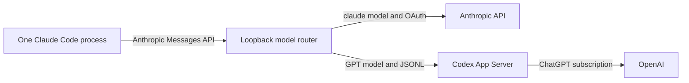

# Claude Code Model Router

**Status**: First edition

**Author**: Laurence Hook

**Companion file**: [bridge-test-matrix.md](bridge-test-matrix.md)

## Purpose

Run one unmodified Claude Code process and choose either Anthropic or GPT models with Claude Code's normal `/model` command.
Claude Code sends every request to one loopback router.
The router selects the provider from the request's `model` field.

## Required behavior

The key words "MUST", "MUST NOT", "SHALL", and "SHALL NOT" are interpreted as described in [BCP 14](https://www.rfc-editor.org/info/bcp14) when they appear in capitals.

- **REQ-001**: The launcher SHALL start the installed bridge and unmodified official native Claude Code and pinned Codex CLI binaries by absolute path. It SHALL derive Claude Code's numeric release version from its canonical native installation path, fetch the version-specific manifest from Anthropic's fixed official HTTPS release origin without following redirects, bound the manifest size and request time, require the exact target artifact, native format, file size, and SHA-256 digest, require the binary's reported version to match that release, and repeat the complete verification immediately before launch. It SHALL reject an unavailable or invalid manifest and SHALL NOT use stale or unverified fallback data. It SHALL verify Codex against its compiled target-specific SHA-256 digest, bypass any same-named terminal command shims, wait up to thirty seconds for a cold bridge to publish its loopback listener, and enforce the loopback route over user, project, local, and caller-supplied settings without bypassing managed enterprise policy.
- **REQ-001A**: At command-line settings precedence, the launcher SHALL neutralize API-key helpers, API-key and bearer-token environment credentials, alternate provider selectors, host-managed provider selection, gateway discovery, current and deprecated model-family overrides, configured fallback models, and the global subagent override so lower settings cannot replace subscription OAuth or Model Rocket's route. It SHALL add the four Anthropic families and every configured GPT route to any lower `availableModels` allowlist. It SHALL reject non-empty `modelOverrides`, disabled hooks, caller-supplied settings, caller-supplied fallback models, safe mode, and bare mode before startup and SHALL install a blocking `ConfigChange` hook for user, project, and local settings so those changes cannot hot-reload into the running process.
- **REQ-002**: The launcher SHALL add the configured canonical route as Claude Code's single supported custom picker option, SHALL preserve the Anthropic picker entries, SHALL NOT enable Claude Code gateway mode or gateway model discovery, and the router SHALL proxy `GET /v1/models` without modifying Anthropic's response.
- **REQ-003**: A `claude-*` Messages request SHALL be streamed unchanged to `https://api.anthropic.com` with Claude Code's Anthropic OAuth bearer.
- **REQ-004**: Each configured GPT route SHALL map to its exact configured Codex model and SHALL use the official `codex app-server` protocol only after a separate discovery process without Model Rocket's generated `model_catalog_json` reports `chatgpt` through `account/read` and its account-backed paged `model/list` confirms every distinct configured model in one bounded, cycle-detecting catalogue read.
- **REQ-005**: The router SHALL make the provider decision independently for every request so one running Claude Code session can change provider after `/model` changes the request model.
- **REQ-006**: The GPT route SHALL carry the Claude system prompt as App Server developer instructions, encode role-bearing conversation history as exact JSON, preserve tools and identifiers, map structured-output schemas to App Server, stream text deltas when requested, and return an Anthropic JSON message for non-stream requests. A tool continuation SHALL be exactly one `tool_result` block in the final user message; mixed content, multiple blocks, or another role SHALL fail explicitly rather than discard conversation data.
- **REQ-006B**: The GPT route SHALL translate every Claude tool name to a provider-safe internal identifier before registering it with App Server, SHALL restore the exact Claude tool name in the returned `tool_use`, and SHALL reject tool calls whose internal identifier was not registered for that turn.
- **REQ-006A**: The GPT route SHALL report exact final App Server token usage when App Server supplies it. Any later text or tool content SHALL invalidate an earlier usage notification until App Server supplies newer usage. A tool continuation SHALL ignore usage queued before new continuation content, including when that continuation completes empty. It SHALL omit final usage when App Server has not reported it on an empty auxiliary turn, an intermediate tool-use boundary, or a turn Model Rocket deliberately interrupted at its output ceiling. It SHALL fail any other text-producing terminal turn without usage and SHALL NOT fabricate a final value. Anthropic SSE `message_start` SHALL carry the protocol-required provisional zero counters; those counters are framing, not reported final usage.
- **REQ-006C**: The GPT route SHALL require a non-empty Messages array whose entries are objects with a `user`, `assistant`, or Claude Code compatibility `system` role and string or array content. A `system` role SHALL contain only a string or text blocks. The route SHALL validate the required fields and role of text, tool-use, and tool-result blocks, SHALL reject known unsupported image and document blocks, and SHALL preserve unrecognized future block types as opaque conversation JSON only for `user` and `assistant` roles.
- **REQ-007**: The GPT route SHALL enforce `max_tokens` with GPT-5's `o200k_base` tokenizer independently of provider chunk boundaries, retain unstable token suffixes until they resolve, preserve UTF-8 boundaries, interrupt an active turn once stable output crosses the ceiling, truncate a terminally resolved overflow locally, and return the `max_tokens` stop reason only when Model Rocket has truncated output.
- **REQ-008**: Unknown models, invalid authentication, unsupported GPT inputs, provider errors, malformed App Server notifications, notifications with no exact active thread and turn, and protocol errors SHALL fail explicitly without retrying through another model or provider. A non-retryable provider error SHALL remain fatal even if a deliberate output interrupt is followed by an `interrupted` terminal status. Every recognized App Server notification and every item in a terminal turn snapshot SHALL be validated against its type-specific required fields even when Model Rocket no longer acts on its content.
- **REQ-009**: A fresh launch-scoped bearer SHALL authenticate Claude Code as part of the loopback base URL path and SHALL be removed when the router constructs every upstream request.
- **REQ-010**: Tool continuations SHALL be bound to Claude's session ID, tool-use ID, and selected Model Rocket route, and locally retained continuation metadata SHALL expire after ten minutes.
- **REQ-011**: The Anthropic OAuth bearer SHALL be sent only to the hardcoded Anthropic API origin and SHALL never enter the Codex request, router environment, or child environment.
- **REQ-012**: The implementation SHALL NOT install a certificate authority, intercept TLS, patch a vendor executable, copy or store a vendor token, accept an Anthropic or OpenAI API key, or call an undocumented provider endpoint.
- **REQ-013**: The router SHALL bind to an automatically selected loopback port, cap request bodies and aggregate non-stream responses at 8 MiB each, reject upstream redirects, and omit credentials and request bodies from logs.
- **REQ-014**: The GPT route SHALL require the target-specific native Codex CLI 0.146.0 executable with its pinned SHA-256 digest, revalidate that executable immediately before every spawn, run one supervised App Server process per bridge instance with a fixed trusted child path and isolated home, disable analytics and Codex-owned tools, multiplex independent Claude requests through distinct App Server threads, cap App Server frames at 8 MiB, and admit at most 64 bridge-owned GPT turn tasks concurrently through its scheduler while excess started tasks wait for admission. A pending Claude tool continuation SHALL retain only its logical App Server thread and SHALL NOT consume turn-scheduler capacity. After an App Server failure, affected work SHALL fail explicitly and the next independent request SHALL start a newly validated process. No public production constructor SHALL accept an executable path or an unvalidated executable token.
- **REQ-015**: The launcher SHALL default the lead Claude Code session to the exact model `claude-fable-5`.
- **REQ-016**: The supplied Claude Code subagent definition SHALL select the configured canonical route with `isolation: worktree` so the Fable lead session can delegate isolated implementation tasks through the same router.
- **REQ-017**: The launcher SHALL configure Claude Code with the smallest context window among all configured Codex models because Claude Code applies one custom-model context value to every configured GPT route.
- **REQ-018**: The launch-scoped routing settings file and model-catalogue snapshot SHALL be readable only by their owner and SHALL be removed when Claude Code exits.
- **REQ-019**: The launcher SHALL remove caller-supplied HTTP proxy variables before launching Claude Code and SHALL force both standard proxy-bypass variables to cover the selected loopback host while preserving existing bypass entries.
- **REQ-020**: Each configured route SHALL select exactly one supported delivery tier and reasoning effort, SHALL map Fast to App Server `serviceTier=priority`, SHALL omit `serviceTier` for Standard, and SHALL enforce Low or High reasoning on every turn.
- **REQ-021**: The implementation SHALL contain explicit domain, application, port, contract, policy, inbound-adapter, outbound-adapter, and composition boundaries and SHALL contain no legacy facade or parallel infrastructure implementation of those boundaries.
- **REQ-021A**: Port declarations SHALL contain only imports, traits, and port-future aliases and SHALL refer only to domain value objects, never primitive values, provider DTOs, file-system paths, JSON framework values, runtime channels, or framework-coupled errors.
- **REQ-021B**: Composition SHALL independently inject the inbound model router, outbound Anthropic gateway, and outbound Codex session factory through ports, and application code SHALL NOT construct HTTP clients, processes, files, or provider DTOs.
- **REQ-021C**: Adapter and port modules SHALL contain no inline string, byte, character, numeric, or boolean literals, and product and protocol literals SHALL live in contract or policy modules.
- **REQ-021D**: A blocking static architecture test SHALL require the final boundary modules, reject legacy locations and transitional aliases, enforce dependency direction, recursively inspect domain types reachable through ports, require the concrete port implementations, and include adversarial tests for each forbidden escape.
- **REQ-022**: The launcher SHALL load one required JSON catalogue with exact `schema_version: 1`, `canonical_route`, `models`, and `routes` fields, copy it to one owner-only launch snapshot, and use that immutable snapshot to select the model IDs checked by independent discovery and to drive launcher settings, serving, and process recovery. The discovery process SHALL NOT receive the generated Codex catalogue used by serving processes. The parser SHALL reject missing or unknown fields, unsupported versions, oversized files or collections, empty catalogues, duplicate or unsafe identifiers, dangling or unused models, a missing canonical route, control characters, invalid delivery or reasoning values, and zero or implausibly large context windows. `MODEL_ROCKET_CONFIG`, when set, SHALL be an absolute path. Catalogue changes SHALL take effect only after a new `claude-gpt` launch and SHALL NOT trigger hot reload or fall back to compiled routes.
- **REQ-022A**: The catalogue SHALL configure only model metadata, route metadata, model mapping, delivery tier, reasoning effort, context window, and canonical selection. It SHALL NOT configure provider origins, credentials, executable paths or digests, headers, tools, base instructions, provider names, raw service-tier values, or arbitrary Codex catalogue JSON. A configured model is compatible only when the pinned Codex App Server exposes it and it satisfies the supported Messages, tools, usage, streaming, and output-limit contract.
- **REQ-023**: One dynamically verified unmodified Claude Code process SHALL complete an Anthropic request, select and complete a request through every route in the shipped catalogue, complete a GPT tool request, and then complete another Anthropic request while provider credentials remain isolated.
- **REQ-024**: The router SHALL write structured operational logs for provider routing, GPT scheduler wait, App Server startup, model-session readiness, first GPT output, total request duration, terminal outcome, and App Server connection failure. The logs SHALL NOT include credentials, request or response content, Claude session IDs, tool identifiers, or working-directory paths. The launcher SHALL report the owner-only runtime log path after the bridge becomes healthy, SHALL retain it when Claude Code exits, SHALL record Claude Code's exit status, and SHALL remove retained logs after seven days.

Discovery confirms model identity only.
Operators validate configured context, delivery tier, reasoning effort, tools, streaming, usage, and output limits by exercising each new route before approval.

The shipped `config/model-routes.json` catalogue defines this default route set:

| Route ID                                         | Display label                      | Delivery | Reasoning | Picker visibility       |
| ------------------------------------------------ | ---------------------------------- | -------- | --------- | ----------------------- |
| `anthropic-model-rocket-gpt-5.6-sol-normal-low`  | GPT-5.6 Sol Normal - Low thinking  | Standard | Low       | Direct command          |
| `anthropic-model-rocket-gpt-5.6-sol-normal-high` | GPT-5.6 Sol Normal - High thinking | Standard | High      | Visible canonical entry |
| `anthropic-model-rocket-gpt-5.6-sol-fast-low`    | GPT-5.6 Sol Fast - Low thinking    | Fast     | Low       | Direct command          |
| `anthropic-model-rocket-gpt-5.6-sol-fast-high`   | GPT-5.6 Sol Fast - High thinking   | Fast     | High      | Direct command          |

Claude Code exposes only one additive custom picker option outside gateway mode.
Gateway mode replaces the parent session's Anthropic subscription OAuth with gateway authentication, so four additive picker rows are outside this edition's supported contract.

## Architecture

Claude Code keeps ownership of its tools, hooks, skills, MCP servers, permissions, transcript, and `/model` interface.
The router only selects a provider and translates the GPT request and response protocol.
Anthropic models and the configured canonical GPT route are visible in the picker.
Every other configured GPT policy uses Claude Code's supported direct `/model <route-id>` command in the same session.

## Acceptance

The automated code gate is `just verify-full`.
Product acceptance additionally requires one unmodified Claude Code process whose picker contains its Anthropic choices plus the canonical Sol entry.
REQ-023 defines the required interactive sequence.

This is an experimental compatibility layer rather than a vendor-supported cross-subscription integration.
Company security approval and current subscription-term review remain deployment prerequisites.

## Known experimental limitations

The 64-turn semaphore limits bridge-owned turn execution but does not bound detached HTTP admission waiters, per-thread App Server event queues, or all upstream work.
An HTTP client disconnect unregisters local routing state but does not interrupt and await the upstream Codex turn.
The ten-minute continuation TTL removes local retained-session metadata but does not close the corresponding upstream App Server thread.
A late event for an unregistered thread can fail the shared App Server connection and affect unrelated turns.
Child-process cleanup starts termination but does not always await the child or preserve its stderr for diagnosis.
